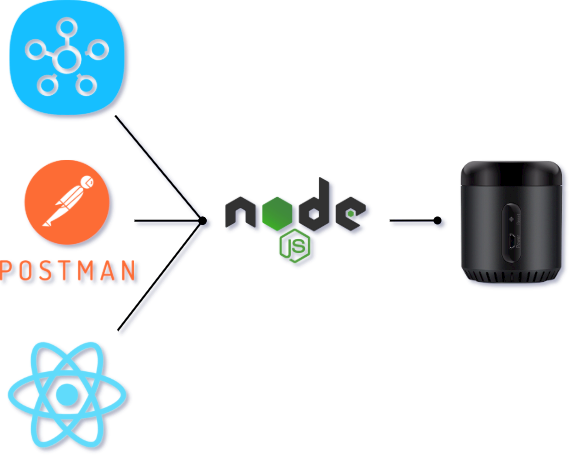

<h1 align="center">BroadLink Bridge</h1>
<h3 align="center">An HTTP REST Bridge for Interacting with BroadLink IR Devices</h3>
<p align="center">
  
  
  <a href="https://github.com/401unauthorized/broadlink-bridge#readme" target="_blank">
    
  </a>
  <a href="https://github.com/401unauthorized/broadlink-bridge/graphs/commit-activity" target="_blank">
    
  </a>
  <a href="https://github.com/401unauthorized/broadlink-bridge/blob/master/LICENSE" target="_blank">
    
  </a>
  <a href="https://twitter.com/stephenmendez_" target="_blank">
    
  </a>
  <a href="https://paypal.me/stephenmendez401" target="_blank">
    
  </a>
</p>

## 💾 Installation

This is a [Node.js](https://nodejs.org/en/) module available through the
[npm registry](https://www.npmjs.com/).

Global installation using the following
[command](https://docs.npmjs.com/downloading-and-installing-packages-globally) is recommended:

`$ npm i -g broadlink-bridge`

Alternatively, the repo can be cloned and linked instead:

`$ git clone https://github.com/401unauthorized/broadlink-bridge.git && cd broadlink-bridge && npm i && npm link`

## 🔌 Quick Start

Run the CLI command to start the server:

`$ broadlink-bridge start -p <port> -t <uuid-based-token>,<uuid-based-token>,...`

> `-p <port>` sets the port

> `-t <uuid-based-token>,...` comma separated list of user created API tokens

## 🔮 Features

- [Express](https://github.com/expressjs/express) powered web server with all the best middleware like [Passport](http://www.passportjs.org/), [Compression](https://github.com/expressjs/compression) & [Helmet](https://helmetjs.github.io/)
- A standard REST API exposing the capability to CRUD and trigger IR commands
- Use a GET/POST request without headers or a body to trigger IR commands (you know, to bookmark a URL to quickly turn on the TV)
- Multiple authentication options (bearer token and query string token)
- JSON formatted database file powered by [Lowdb](https://github.com/typicode/lowdb/blob/master/README.md) and [Lodash](https://lodash.com) enabling effortless modification, backup and sharing opportunities
- An accompanying [SmartThings](https://docs.smartthings.com/en/latest/device-type-developers-guide/quick-start.html) Device Handler example (Well, It's Coming Soon...)
- And a free "quick start" Postman Collection and example database!

## 👓 Transparency

- This is a personal project and will only be maintained as needed (unless there is community interest)
- You may have noticed there are no tests of any type. This may or may not change in the future. A TDD approach without the T.
- Additional BroadLink devices may be compatible but this was only developed for the Broadlink RM Mini3
- Should not be considered "production ready", used in critical implementations or the API exposed publicly
- Additional [security concerns & known vulnerabilities](https://github.com/401unauthorized/broadlink-bridge/blob/master/SECURITY.md) should be reviewed and acknowledged prior to running the server

## 📊 System Diagram

<div align="center">
  
</div>

***

## 🛠 Setup & Getting Started

### Connect a Blaster

> Please note, the following was only tested with the RM mini3

Connecting a new BroadLink device on your local wireless network:

1. Put the device into AP Mode (reference device manual)
    1. Long press the reset button until the blue LED is blinking quickly
    2. Long press again until blue LED is blinking slowly
2. Manually connect your computer to the WiFi SSID named _BroadlinkProv_
3. Use the CLI to provide your wifi name (SSID), wifi password, and the security mode number to the device:

| Number | Security    |
| ------ | ----------- |
| 0      | none (open) |
| 1      | WEP         |
| 2      | WPA1        |
| 3      | WPA2        |
| 4      | WPA1/2      |

`$ broadlink-bridge connect -w wifi_name -p wifi_password -s 3`

### Review Server Files

To locate configuration and data files on your machine, run the following: 

`$ broadlink-bridge files`

> Prints the following information to stdout

```JSON
{
  "db.json": "/path/to/db.json",
  "db-example.json": "/path/to/db-example.json",
  ".env": "/path/to/.env",
  "postman-bearer-token": "/path/to/broadlink-bridge_bearer_auth.postman_collection.json",
  "postman-query-string": "/path/to/broadlink-bridge_query_string_auth.postman_collection.json"
}
```

#### db.json

This is the local JSON database file used for Broadlink-Bridge.

While the server is not running, this file can be manually edited for advanced use cases.

#### db-example.json

This is a starting **example** of local JSON database file for Broadlink-Bridge.

Rename this file to `db.json` for use with the **example postman collections**.

#### .env

This file is used to store persistant environmental variables and sensitive information for the server.

After installation, it is advised to create/update this file.

Example of storing information in this file:

```BASH
PORT=8080
TOKENS=aaaaaaaa-aaaa-aaaa-aaaa-aaaaaaaaaaaa,12345678-9012-3456-7890-123456789012
```

#### postman-bearer-token

This [postman collection](https://www.postman.com/downloads/) provides **example** requests for interacting with the server using authentication bearer tokens.

[Importing into Postman](https://learning.postman.com/docs/postman/collections/importing-and-exporting-data/#importing-data-into-postman):
1. Find and Replace `<insert-API-token-here>` in the `.json` file with an API Token used by the server
2. In postman, select *import* and navigate to the location of the file

#### postman-query-string

This [postman collection](https://www.postman.com/downloads/) provides **example** requests for interacting with the server using query string tokens.

[Importing into Postman](https://learning.postman.com/docs/postman/collections/importing-and-exporting-data/#importing-data-into-postman):
1. Find and Replace `<insert-API-token-here>` in the `.json` file with an API Token used by the server
2. In postman, select *import* and navigate to the location of the file

### API Credentials

API tokens are **required** with most endpoints and may be defined in the following ways:

> Passed in as an argument

`$ broadlink-bridge start -t <uuid-based-token>,<uuid-based-token>,...`

> Defined in the `.env` file

`TOKENS=<uuid-based-token>,<uuid-based-token>,...`

### Running the Server

Run the CLI command to start the server:

`$ broadlink-bridge start -p <port> -t <uuid-based-token>,<uuid-based-token>,...`

For a full list of commands, enter the following:

`$ broadlink-bridge --help`

### Final Steps

Use the following API endpoints described in this documentation to perform the steps:
1. Add a new Blaster
2. Add a new Device for that Blaster
3. Add (learn) new Commands for that Device
4. Emit one of those commands
5. Celebrate! 🎉

***

## 📦 Database Schema

The JSON database file contains two, top level fields: `blasters` & `devices`.

`blasters` contains an array of blaster objects. 

`devices` contains an array of device objects. 

#### Blaster Object

A BroadLink IR Blaster

```JSON
{
  "id": "pMtEfSYMmg",
  "name": "Basement Blaster",
  "type": "RM Mini3",
  "address": "192.168.1.2",
  "port": 80,
  "mac": "AA:BB:CC:DD:EE:FF",
  "devices": [ "GZFnCHSDM" ],
  "active": false
}
```

**id:** An auto-generated short ID

**name:** A user entered blaster name

**type:** A user entered blaster type (not used)

**address:** LAN IP address for the blaster

**port:** Port for the blaster

**mac:** MAC address for the blaster

**devices:** An array of device IDs this blaster controls 

**active:** Is the server able to reach the blaster? (updated dynamically)

#### Device Object

Any Device with IR Receiver Capabilities

```JSON
{
  "id": "GZFnCHSDM",
  "name": "Basement Projector",
  "type": "PROJECTOR",
  "commands": []
}
```

**id:** An auto-generated short ID

**name:** A user entered device name

**type:** A user entered device type (not used)

**commands:** An array of IR command objects for the device

#### Commands Object

IR Codes & Metadata

```JSON
{
  "command": "power on",
  "repeat": 0,
  "delay": 0,
  "data": "260054000001299316101512141215111511151115111536153615361537153615361536153616111437153615361536143815111536151115111511151115111412153715111536150003750900019200012a4812000d0500000000"
}
```

**command:** A user entered command name (must be URL encodable)

**repeat:** A user entered repeat count for the command (not used)

**delay:** A user entered milliseconds delay between repeats for the command (not used)

**data:** A user entered or a blaster captured hex string representation of an IR command

#### Complete Example of db.json Database File

```JSON
{
  "blasters": [
    {
      "id": "pMtEfSYMmg",
      "name": "Basement Blaster",
      "type": "RM Mini3",
      "address": "192.168.1.2",
      "port": 80,
      "mac": "AA:BB:CC:DD:EE:FF",
      "devices": [
          "GZFnCHSDM"
      ],
      "active": false
    }
  ],
  "devices": [
    {
      "id": "GZFnCHSDM",
      "name": "Basement Projector",
      "type": "PROJECTOR",
      "commands": [
        {
          "command": "power on",
          "repeat": 0,
          "delay": 0,
          "data": "260054000001299316101512141215111511151115111536153615361537153615361536153616111437153615361536143815111536151115111511151115111412153715111536150003750900019200012a4812000d0500000000"
        }
      ]
    }
  ]
}
```


## 🌐 API

> Most endpoints require authentication via an `authentication bearer token` or a `query string token`

### Authentication Bearer Token (Header)

`"Authentication": "Bearer <token-here>"`

### Query String Token (Query String)

`?token=<token-here>`

### Generic Endpoints

#### /

> Request (Body)

--

> Response (Body)

`Welcome to BroadLink Bridge!`

#### /health

> Request (Body)

--

> Response (Body)

`OK`

#### /version

> Request (Body)

--

> Response (Body)

```JSON
{
  "version": "1.0.0"
}
```

#### /stats

> Request (Body)

--

> Response (Body)

```JSON
{
  "timestamp": 1589701522333,
  "uptime": {
      "duration": 64.125,
      "text": "a minute",
      "started": "2020-05-17T07:44:18.209Z"
  },
  "process": {
      "rss": 47550464,
      "heapTotal": 25456640,
      "heapUsed": 16501232,
      "external": 63281,
      "pid": 12345
  }
}
```

### Blaster Endpoints

#### GET /blasters/

Read all Blasters

> Request (Body)

--

> Response (Body)

```JSON
[
  {
    "id": "pMtEfSYMmg",
    "name": "Basement Blaster",
    "type": "RM Mini3",
    "address": "192.168.1.2",
    "port": 80,
    "mac": "AA:BB:CC:DD:EE:FF",
    "devices": [ "GZFnCHSDM" ],
    "active": false
  }
]
```

#### POST /blasters/

Create a new Blaster

> Request (Body)

```JSON
{
  "name": "Basement Blaster",
  "type": "RM Mini3",
  "address": "192.168.1.2",
  "port": 80,
  "mac": "AA:BB:CC:DD:EE:FF"
}
```

> Response (Body)

```JSON
{
  "id": "pMtEfSYMmg",
  "name": "Basement Blaster",
  "type": "RM Mini3",
  "address": "192.168.1.2",
  "port": 80,
  "mac": "AA:BB:CC:DD:EE:FF",
  "devices": [],
  "active": false
}
```

#### GET /blasters/\<blaster-id>/

Read a specific Blaster

> Request (Body)

--

> Response (Body)

```JSON
{
  "id": "pMtEfSYMmg",
  "name": "Basement Blaster",
  "type": "RM Mini3",
  "address": "192.168.1.2",
  "port": 80,
  "mac": "AA:BB:CC:DD:EE:FF",
  "devices": [],
  "active": true
}
```

#### PUT /blasters/\<blaster-id>/

Update a specific Blaster

> Request (Body)

```JSON
{
  "name": "Basement Blaster Updated"
}
```

> Response (Body)

```JSON
{
  "id": "pMtEfSYMmg",
  "name": "Basement Blaster Updated",
  "type": "RM Mini3",
  "address": "192.168.1.2",
  "port": 80,
  "mac": "AA:BB:CC:DD:EE:FF",
  "devices": [],
  "active": true
}
```

#### DELETE /blasters/\<blaster-id>/

Delete a specific Blaster

### Device Endpoints

#### GET /blasters/\<blaster-id>/devices/

Read a Blaster's Devices

> Request (Body)

--

> Response (Body)

```JSON
[
  {
    "id": "GZFnCHSDM",
    "name": "Basement Projector",
    "type": "PROJECTOR",
    "commands": [
      {
        "command": "power on",
        "repeat": 0,
        "delay": 0,
        "data": "260054000001299316101512141215111511151115111536153615361537153615361536153616111437153615361536143815111536151115111511151115111412153715111536150003750900019200012a4812000d0500000000"
      },
      {
        "command": "power off",
        "repeat": 1,
        "delay": 300,
        "data": "260054000001299316101512141215111511151115111536153615361537153615361536153616111437153615361536143815111536151115111511151115111412153715111536150003750900019200012a4812000d0500000000"
      },
      ...
    ]
  },
  ...
]
```

#### POST /blasters/\<blaster-id>/devices/

Create a new Blaster's Device

> Request (Body)

```JSON
{
  "name": "Basement Projector",
  "type": "PROJECTOR"
}
```

> Response (Body)

```JSON
{
  "id": "GZFnCHSDM",
  "name": "Basement Projector",
  "type": "PROJECTOR",
  "commands": []
}
```

#### GET /blasters/\<blaster-id>/devices/\<device-id>/

Read a specific Blaster's Device

> Request (Body)

--

> Response (Body)

```JSON
{
  "id": "GZFnCHSDM",
  "name": "Basement Projector",
  "type": "PROJECTOR",
  "commands": [
    {
      "command": "power on",
      "repeat": 0,
      "delay": 0,
      "data": "260054000001299316101512141215111511151115111536153615361537153615361536153616111437153615361536143815111536151115111511151115111412153715111536150003750900019200012a4812000d0500000000"
    },
    {
      "command": "power off",
      "repeat": 1,
      "delay": 300,
      "data": "260054000001299316101512141215111511151115111536153615361537153615361536153616111437153615361536143815111536151115111511151115111412153715111536150003750900019200012a4812000d0500000000"
    },
    ...
  ]
}
```

#### PUT /blasters/\<blaster-id>/devices/\<device-id>/

Update a specific Blaster's Device

> Request (Body)

```JSON
{
  "name": "Basement Wall Projector"
}
```

> Response (Body)

```JSON
{
  "id": "GZFnCHSDM",
  "name": "Basement Wall Projector",
  "type": "PROJECTOR",
  "commands": [
    {
      "command": "power on",
      "repeat": 0,
      "delay": 0,
      "data": "260054000001299316101512141215111511151115111536153615361537153615361536153616111437153615361536143815111536151115111511151115111412153715111536150003750900019200012a4812000d0500000000"
    },
    {
      "command": "power off",
      "repeat": 1,
      "delay": 300,
      "data": "260054000001299316101512141215111511151115111536153615361537153615361536153616111437153615361536143815111536151115111511151115111412153715111536150003750900019200012a4812000d0500000000"
    },
    ...
  ]
}
```

#### DELETE /blasters/\<blaster-id>/devices/\<device-id>/

Delete a specific Blaster's Device

### Command Endpoints

#### GET /blasters/\<blaster-id>/devices/\<device-id>/commands/

Read a Blaster's Device's Commands

> Request (Body)

--

> Response (Body)

```JSON
[
  {
    "command": "power on",
    "repeat": 0,
    "delay": 0,
    "data": "260054000001299316101512141215111511151115111536153615361537153615361536153616111437153615361536143815111536151115111511151115111412153715111536150003750900019200012a4812000d0500000000"
  },
  {
    "command": "power off",
    "repeat": 1,
    "delay": 300,
    "data": "260054000001299316101512141215111511151115111536153615361537153615361536153616111437153615361536143815111536151115111511151115111412153715111536150003750900019200012a4812000d0500000000"
  },
  ...
]
```

#### POST /blasters/\<blaster-id>/devices/\<device-id>/commands/

Create a new Blaster's Device's Command.

If the HEX IR code **is unknown**, start a learning process:
1. Call the endpoint with the desired `command` name in the request JSON body
2. Within 10 seconds, point an IR remote at the blaster and press the corresponding `command` button
3. Wait for a response to ensure it was captured correctly

> Request (Body)

```JSON
{
  "command": "power on",
  "repeat": 0,
  "delay": 0
}
```

If the HEX IR code **is already known** :
1. Include a string representation of the data as a field 

> Request (Body)

```JSON
{
  "command": "power on",
  "repeat": 0,
  "delay": 0,
  "data": "260054000001299316101512141215111511151115111536153615361537153615361536153616111437153615361536143815111536151115111511151115111412153715111536150003750900019200012a4812000d0500000000"
}
```

> Response (Body)

```JSON
{
  "command": "power on",
  "repeat": 0,
  "delay": 0,
  "data": "260054000001299316101512141215111511151115111536153615361537153615361536153616111437153615361536143815111536151115111511151115111412153715111536150003750900019200012a4812000d0500000000"
}
```

#### GET /blasters/\<blaster-id>/devices/\<device-id>/commands/\<command-name>/

Read a Blaster's Device's specific Command

> Request (Body)

--

> Response (Body)

```JSON
{
  "command": "power on",
  "repeat": 0,
  "delay": 0,
  "data": "260054000001299316101512141215111511151115111536153615361537153615361536153616111437153615361536143815111536151115111511151115111412153715111536150003750900019200012a4812000d0500000000"
}
```

#### PUT /blasters/\<blaster-id>/devices/\<device-id>/commands/\<command-name>/

Update a Blaster's Device's specific Command

> Request (Body)

```JSON
{
    "repeat": 1,
    "delay": 200
}
```

> Response (Body)

```JSON
{
  "command": "power on",
  "repeat": 1,
  "delay": 200,
  "data": "260054000001299316101512141215111511151115111536153615361537153615361536153616111437153615361536143815111536151115111511151115111412153715111536150003750900019200012a4812000d0500000000"
}
```

#### DELETE /blasters/\<blaster-id>/devices/\<device-id>/commands/\<command-name>/

Delete a Blaster's Device's specific Command

### Emit IR Endpoints

#### POST /blasters/\<blaster-id>/devices/\<device-id>/commands/\<command-name>/emit

> Request (Body)

--

> Response (Body)

```JSON
{
  "status": "Done!"
}
```

#### GET /blasters/\<blaster-id>/devices/\<device-id>/commands/\<command-name>/emit

> Request (Body)

--

> Response (Body)

```JSON
{
  "status": "Done!"
}
```

## 👤 Author

 **Stephen Mendez**

- Website: https://www.stephenmendez.dev
- Twitter: [@stephenmendez\_](https://twitter.com/stephenmendez_)
- Github: [@401unauthorized](https://github.com/401unauthorized)

## 🤝 Contributing

Contributions, issues and feature requests are welcome!<br />Feel free to check [issues page](https://github.com/401unauthorized/broadlink-bridge/issues). You can also take a look at the [contributing guide](https://github.com/401unauthorized/broadlink-bridge/blob/master/CONTRIBUTING.md).

## 😃 Show your support

Give a ⭐️if this project helped you!

Consider making a donation of any amount!

<a href="https://paypal.me/stephenmendez401" target="_blank">
    
</a>

## 📝 License

Copyright © 2020 Stephen Mendez<br />
This project is [MIT](https://github.com/401unauthorized/broadlink-bridge/blob/master/LICENSE) licensed.

---
BroadLink is a registered trademark of Hangzhou BroadLink Technology Co. Ltd

_Part of this README was generated with ❤️ by [readme-md-generator](https://github.com/kefranabg/readme-md-generator)_


